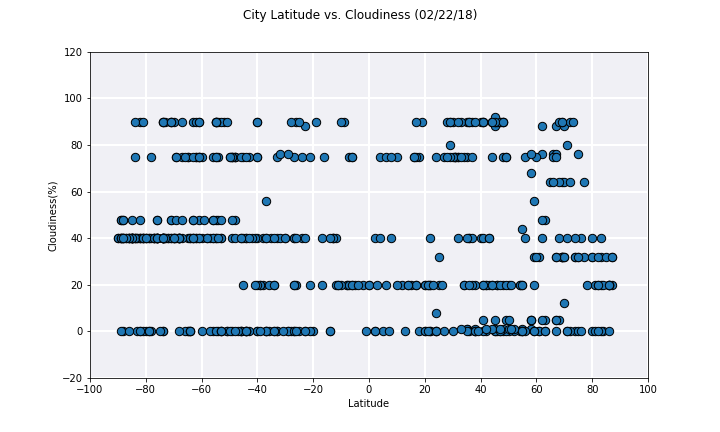
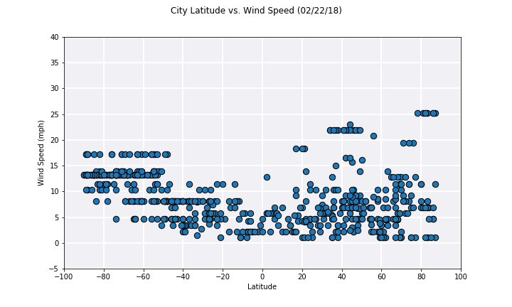

# Data Analysis on Pyweather
----
## Conclusion

Data analysis was performed on weather data and latitude of 600 random cities.
Collected Data can be seen at [City Data](Data/Weather_data_600_cities.csv)

### Trend 1:

By comparing Latitude and max temperature of 600 cities on Feb 22nd, it is clear that cities in southern atmosphere are much warmer.
Northern atmosphere is much colder as expected. None of the southern atmosphere cities reach 100 degree F. This means its not that hot over there. Southern atmosphere cities are probably good destination for vacation, but we need more data is needed to make sure.

### Trend 2:

There are no pattern in cloudiness and data is scattered all over the place.

### Trend 3:

There are some cities in Northern atmosphere which have comparatively high wind speed of 25, but no city reaches above 50 on February 22nd 2018.

----
## Tasks completed:

Your objective is to build a series of scatter plots to showcase the following relationships:

* Temperature (F) vs. Latitude
* Humidity (%) vs. Latitude
* Cloudiness (%) vs. Latitude
* Wind Speed (mph) vs. Latitude

Your final notebook must:

* Randomly select **at least** 500 unique (non-repeat) cities based on latitude and longitude.
* Perform a weather check on each of the cities using a series of successive API calls. 
* Include a print log of each city as it's being processed with the city number, city name, and requested URL.
* Save both a CSV of all data retrieved and png images for each scatter plot.

---
## changelog
* 22-Feb-2018 
