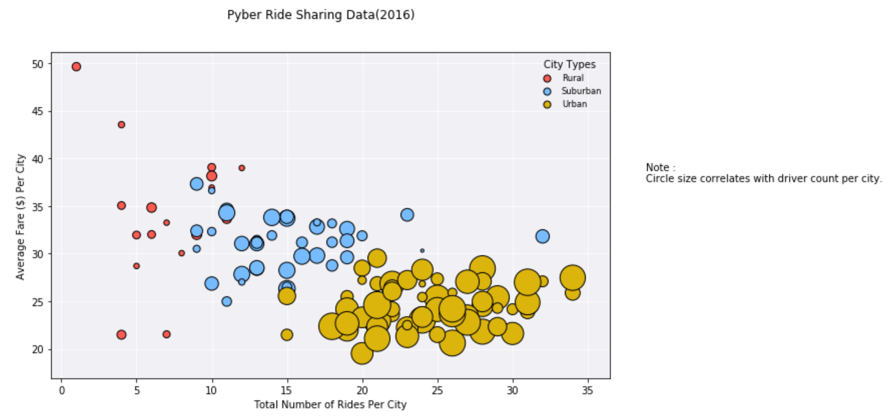

# Data Analysis on Pyber rides
----
## Conclusion

> Data analysis was performed on ride data set (city_data.csv, ride_data.csv) and following observations were made:

----

### Trend 1:
Company should definitely focus on Rural areas. They have less number of rides there probably due to less number of drivers.

----
### Trend 2:
If you see the graph there is some overlap in number of rides per city data between suburban and rural areas. 
However there are more number of drivers in suburban areas compared to rural area. 
This means company needs to do more marketing towards consumers in suburban areas.

----
### Trend 3:
People are clearly ready to pay more money for the ride in rural areas. 
There is a big difference in average price paid per city among different cities in rural areas.
Company should consider changing their pricing model to attract more riders. 

----
## Tasks completed:
Your objective is to build a [Bubble Plot](https://en.wikipedia.org/wiki/Bubble_chart) that showcases the relationship between four key variables:

* Average Fare ($) Per City
* Total Number of Rides Per City
* Total Number of Drivers Per City
* City Type (Urban, Suburban, Rural)

In addition, you will be expected to produce the following three pie charts:

* % of Total Fares by City Type
* % of Total Rides by City Type
* % of Total Drivers by City Type

As final considerations:

* You must use the Pandas Library and the Jupyter Notebook.
* You must use the Matplotlib and Seaborn libraries.
* You must include a written description of three observable trends based on the data.
* You must use proper labeling of your plots, including aspects like: Plot Titles, Axes Labels, Legend Labels, Wedge Percentages, and Wedge Labels.
* Remember when making your plots to consider aesthetics!
  * You must stick to the Pyber color scheme (Gold, Light Sky Blue, and Light Coral) in producing your plot and pie charts.
  * When making your Bubble Plot, experiment with effects like `alpha`, `edgecolor`, and `linewidths`.
  * When making your Pie Chart, experiment with effects like `shadow`, `startangle`, and `explosion`.
* You must include an exported markdown version of your Notebook called  `README.md` in your GitHub repository.
* See [Example Solution](Pyber/Pyber_Example.pdf) for a reference on expected format.

---
## changelog
* 13-Feb-2018 
