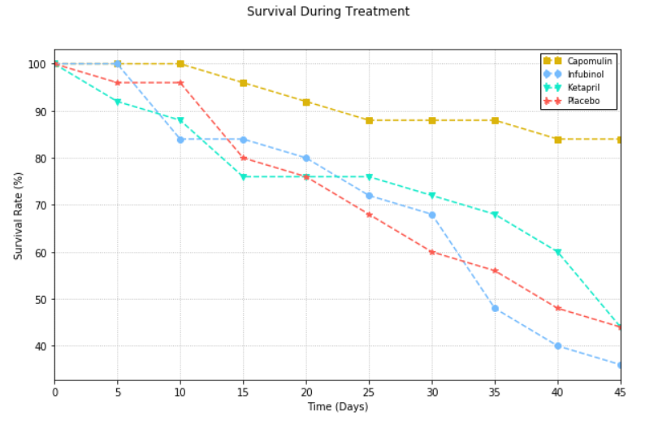
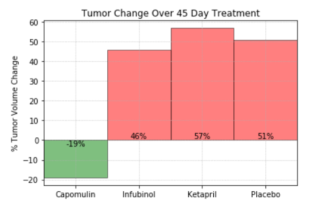
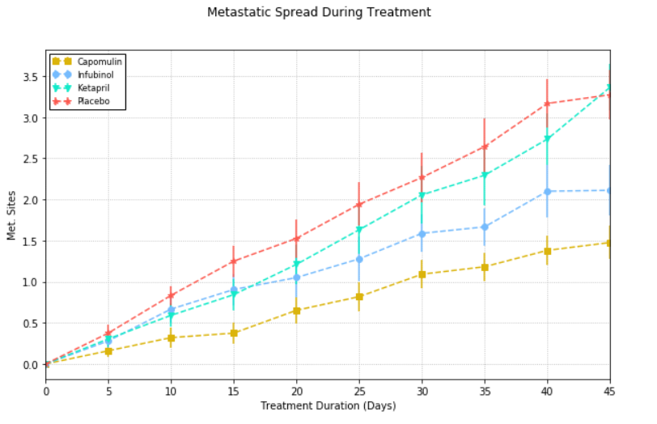

# Data Analysis on Pymaceuticals Research
----
## Conclusion

> Data analysis was performed on data set of 'Ketapril', 'Capomulin', 'Infubinol', 'Placebo' drugs (mouse_drug_data.csv, clinicaltrial_data.csv) and following observations were made:

----

### Trend 1:

Capomulin has definitely better survival rate in mice. Results of other drugs are very similar to placebo. 

----
### Trend 2:

Negative Change in tumor volume further confirms effectiveness of Capomulin.
Other drugs are simply non effective as their results are similar to placebo.

----
### Trend 3:

Number of Metastatic sites are increasing in treatments including Capomulin drug.
However there is significant standard error measurement in the mean value. This suggest that may be we should get more samples and verify the source of data.

----
## Tasks completed:

* Creating a scatter plot that shows how the tumor volume changes over time for each treatment.
* Creating a scatter plot that shows how the number of [metastatic](https://en.wikipedia.org/wiki/Metastasis) (cancer spreading) sites changes over time for each treatment.
* Creating a scatter plot that shows the number of mice still alive through the course of treatment (Survival Rate)
* Creating a bar graph that compares the total % tumor volume change for each drug across the full 45 days.

As final considerations:

* You must use the Pandas Library and the Jupyter Notebook.
* You must use the Matplotlib and Seaborn libraries.
* You must include a written description of three observable trends based on the data.
* You must use proper labeling of your plots, including aspects like: Plot Titles, Axes Labels, Legend Labels, X and Y Axis Limits, etc.
* Your scatter plots must include [error bars](https://en.wikipedia.org/wiki/Error_bar). This will allow the company to account for variability between mice. You may want to look into [`pandas.DataFrame.sem`](http://pandas.pydata.org/pandas-docs/stable/generated/pandas.DataFrame.sem.html) for ideas on how to calculate this.
* Remember when making your plots to consider aesthetics!
  * Your legends should not be overlaid on top of any data.
  * Your bar graph should indicate tumor growth as red and tumor reduction as green.
    It should also include a label with the percentage change for each bar. You may want to consult this [tutorial](http://composition.al/blog/2015/11/29/a-better-way-to-add-labels-to-bar-charts-with-matplotlib/) for relevant code snippets.
* You must include an exported markdown version of your Notebook called  `README.md` in your GitHub repository.

---
## changelog
* 15-Feb-2018 
