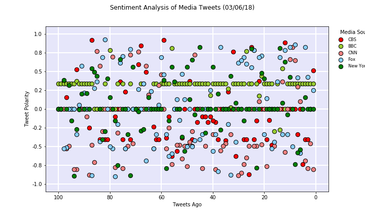
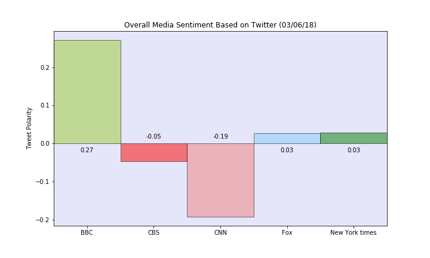

# Sentiment Analysis on tweeter feeds of 5 news agencies
----
## Conclusion

Sentiment analysis was performed on tweeter feeds of 5 news agencies.
'CBS'
'BBC'
'CNN'
'Fox' 
'New York times'

Data collected in csv is at [csv](docs/Tweet_sentiments.csv)

### Trend 1:

Most of the tweets are scatter with mixed sentiments except BBC. 
It is very odd to have several tweets of BBC have same positive sentiment.
It is suspicious and seems to be work of chat bot to create positive influence on the users. 
### Trend 2:

BBC has positive sentiment probably due to chat bot activity as mentioned earlier.
CNN news has negative sentiment in last 100 tweets.
Others have aggregate sentiment to near zero.

### Trend 3:

This sentiment analysis gives some insight of user sentiments but does not give overall picture.
1. 100 tweets are not enough to judge sentiments. Data changes at every rerun.  We need at least 6 month of data, to see complete picture.
2. Tweets can be directed to pessimistic article on new agency and does not reflect news agency performance. 

----
## Tasks completed:

The first plot will be and/or feature the following:

Be a scatter plot of sentiments of the last 100 tweets sent out by each news organization, ranging from -1.0 to 1.0, where a score of 0 expresses a neutral sentiment, -1 the most negative sentiment possible, and +1 the most positive sentiment possible.
Each plot point will reflect the compound sentiment of a tweet.
Sort each plot point by its relative time stamp.
The second plot will be a bar plot visualizing the overall sentiments of the last 100 tweets from each organization. For this plot, you will again aggregate the compound sentiments analyzed by VADER.

The tools of the trade you will need for your task as a data analyst include the following: tweepy, pandas, matplotlib, seaborn, textblob, and VADER.

Your final Jupyter notebook must:

Pull last 100 tweets from each outlet.
Perform a sentiment analysis with the compound, positive, neutral, and negative scoring for each tweet.
Pull into a DataFrame the tweet's source acount, its text, its date, and its compound, positive, neutral, and negative sentiment scores.
Export the data in the DataFrame into a CSV file.
Save PNG images for each plot.
As final considerations:

Use the Matplotlib and Seaborn libraries.
Include a written description of three observable trends based on the data.
Include proper labeling of your plots, including plot titles (with date of analysis) and axes labels.
Include an exported markdown version of your Notebook called README.md in your GitHub repository.

---
## changelog
* 03-Mar-2018 
